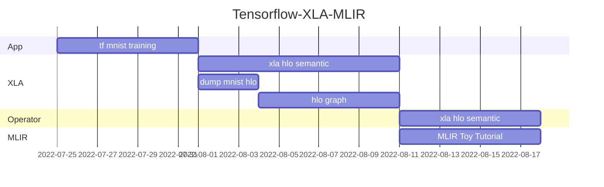
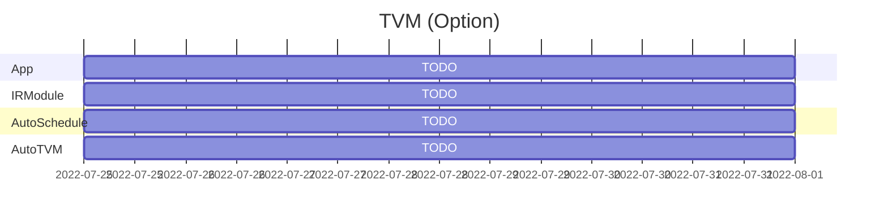

# AI Software Stack Tutorial

This is an introduction to AI heterogeneous software stacks for project managers or project leaders. We will start with a simple application and step by step into the internals of the software stack. This tutorial will focus on the performance of the problems encountered in the AI application layer in the software stack, while the lower-level AI accelerator hardware SOC and ISA will be covered in one stroke.

## Tensorflow

Task:

* 安装 Anaconda + Tensorflow115-gpu。
* 使用Tensorflow构建MNIST模型，并且进行训练。
* 将模型加载到XLA-CPU或者XLA-GPU上，并且dump xla hlo graph
* 学习 [XLA算子语义](https://www.tensorflow.org/xla/operation_semantics)
* 理解静态模型

Task:

* 了解MLIR

## TVM

